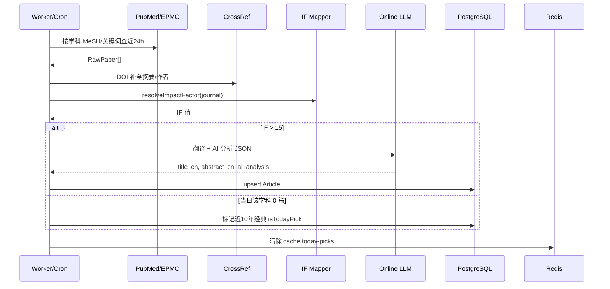

# MedFrontier 系统架构设计

## 1. 业务目标

每日自动为 5 个学科推送 **IF > 15** 且已通过 PubMed/CrossRef 真实性校验的高影响因子论文；无可验证文献时展示空状态，不回退或生成替代论文；详情页提供 **在线 LLM** 中英翻译与结构化 AI 分析。

| 学科 | 枚举值 | 重点方向 |
|------|--------|----------|
| 肿瘤科 | `ONCOLOGY_COLORECTAL` | 结直肠癌 |
| 眼科 | `OPHTHALMOLOGY` | — |
| 消化内科 | `GASTROENTEROLOGY` | — |
| 泌尿外科 | `UROLOGY` | — |
| 肾内科 | `NEPHROLOGY` | — |

---

## 2. 总体架构

```
┌──────────────────────────────────────────────────────────────────┐
│                     浏览器 (Next.js 15 SSR)                       │
│  首页 · 学科页 · 详情页 · 搜索 · 关于 · SEO(sitemap/robots/OG)    │
└────────────────────────────┬─────────────────────────────────────┘
                             │ HTTP
┌────────────────────────────▼─────────────────────────────────────┐
│                    Next.js App Router API                         │
│  /api/articles  /api/search  /api/cron/daily-fetch                │
│  /api/favorites  /api/subscriptions                               │
└───────┬──────────────────────────────┬───────────────────────────┘
        │                              │
        ▼                              ▼
┌───────────────┐              ┌───────────────┐
│  PostgreSQL   │              │     Redis      │
│  Prisma ORM   │              │  首页缓存 TTL   │
│  Article 等   │              │  BullMQ 队列   │
└───────▲───────┘              └───────▲───────┘
        │                              │
        │         ┌────────────────────┘
        │         │
┌───────┴─────────▼────────────────────────────────────────────────┐
│              每日 Pipeline (BullMQ Worker / Cron API)             │
│  ① PubMed E-utilities + Europe PMC 抓取近 24h                     │
│  ② CrossRef DOI 元数据补全                                        │
│  ③ 期刊 IF 匹配 (本地 JSON + JournalIf 表，可扩展 JCR/Scimago)    │
│  ④ IF > 15 筛选 + 顶刊加权                                        │
│  ⑤ 关键词规则分类 基础/临床                                       │
│  ⑥ 在线 LLM：翻译 + 结构化分析 JSON                               │
│  ⑦ 写入 DB + 清除 Redis 缓存                                      │
│  ⑧ 学科无新文献 → 回退近10年 landmark 经典                        │
└────────────────────────────┬─────────────────────────────────────┘
                             │
        ┌────────────────────┼────────────────────┐
        ▼                    ▼                    ▼
   PubMed API          Europe PMC API         CrossRef API
                             │
                             ▼
              OpenRouter / DeepSeek / Qwen 等 (OpenAI 兼容 API)
```

**新手解释**：
- **SSR** = 网页在服务器上先生成好再发给浏览器，利于 SEO。
- **ORM (Prisma)** = 用 TypeScript 代码操作数据库，不用手写大量 SQL。
- **BullMQ** = 基于 Redis 的定时任务队列，每天凌晨自动跑抓取。

---

## 3. 数据流（每日任务）



---

## 4. IF（影响因子）可扩展方案

| 层级 | 实现 | 说明 |
|------|------|------|
| L1 | `data/journal-impact-factors.json` | 顶刊及子刊静态表，开箱即用 |
| L2 | `JournalIf` Prisma 表 | `seedJournalTable()` 启动时同步 |
| L3 (预留) | JCR CSV 导入脚本 | 对接 Clarivate Journal Citation Reports |
| L4 (预留) | Scimago API | 按 ISSN 拉取 SJR/IF 近似值 |

筛选函数：`passesIfFilter(if) => if > 15`；顶刊在排序时优先（`isTopJournal`）。

---

## 5. 分类逻辑

### 5.1 学科

抓取阶段按 **PubMed 检索式**（`SPECIALTY_CONFIG.pubmedQuery`）限定学科。

### 5.2 基础 vs 临床

`src/lib/classifier.ts`：基于标题/摘要/文章类型的 **关键词规则**（如 `randomized`, `clinical trial` → 临床；`mouse`, `in vitro` → 基础）。可后续改为 LLM 二次分类。

---

## 6. AI 分析 Pipeline（在线调度）

**不本地部署模型**，统一走 OpenAI 兼容 HTTP API（OpenRouter / DeepSeek / Qwen 等）。

| 步骤 | 模块 | 输出 |
|------|------|------|
| 1 | `translatePaper()` | `title_cn`, `abstract_cn`, `one_line_summary` |
| 2 | `analyzePaper()` | 结构化 `AiAnalysis` JSON |
| 3 | 存入 `Article.aiAnalysisJson` | 详情页 `AiAnalysisPanel` 渲染 |

Prompt 模板：`src/lib/llm/prompts.ts`

JSON Schema（Zod 校验）：

```json
{
  "goal": "研究目的",
  "conclusion": "研究结论",
  "methods": "方法简述",
  "design": ["实验设计项"],
  "technologies": ["核心技术"],
  "clinical_significance": "临床意义",
  "keywords_cn_en": [{ "en": "", "cn": "" }]
}
```

---

## 7. 数据库模型（Prisma）

核心表：`Article`（论文）、`JournalIf`（期刊 IF）、`FetchLog`（抓取日志）、`User`/`Favorite`/`Subscription`（用户扩展）。

详见 `prisma/schema.prisma`。

---

## 8. 缓存策略

| Key | 内容 | TTL |
|-----|------|-----|
| `cache:today-picks` | 首页卡片 DTO 列表 | 1h |
| `cache:article:{id}` | 单篇详情 | 1h |

Pipeline 结束后 `cacheDel("cache:*")` 失效。

---

## 9. 部署拓扑 (Docker Compose)

| 服务 | 端口 | 职责 |
|------|------|------|
| postgres | 5432 | 主库 |
| redis | 6379 | 缓存 + 队列 |
| app | 3000 | Next.js 网站 |
| worker | — | BullMQ 每日 02:00 抓取 |

---

## 10. 预留扩展

- **邮件订阅**：`Subscription` + SMTP 环境变量
- **Telegram / 微信**：`.env` Webhook 预留
- **RAG / 向量推荐**：`Article` 增加 `embedding` + pgvector
- **热点可视化**：基于 `keywords` 聚合统计 API

---

## 11. 安全与合规

- Cron API 需 `CRON_SECRET` 查询参数
- LLM API Key 仅存服务端环境变量
- 免责声明：AI 分析仅供科研学习，非医疗建议
